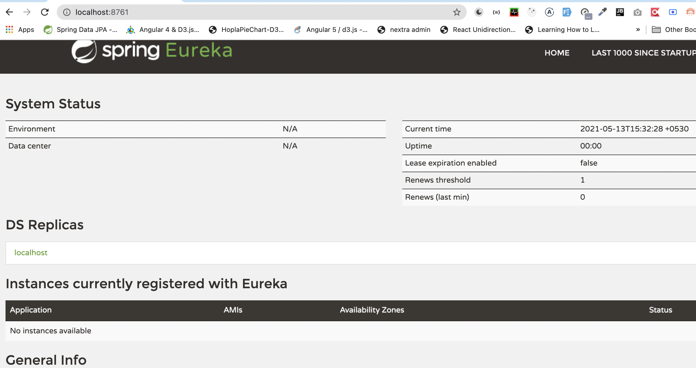

### 1. Create a project with only one dependency
```xml
<dependency>
    <groupId>org.springframework.cloud</groupId>
    <artifactId>spring-cloud-starter-netflix-eureka-server</artifactId>
</dependency>
```
### 2. Add the following annotation `@EnableEurekaServer` in the `ServiceDiscoveryApplication` class
```java
@SpringBootApplication
@EnableEurekaServer
public class ServiceDiscoveryApplication {

    public static void main(String[] args) {
        SpringApplication.run(ServiceDiscoveryApplication.class, args);
    }

}
```

### 3. To mark this application as `server` and not the `discovery` client we will add the following properties in `application.yml` file
```yaml
eureka:
  client:
    register-with-eureka: false
    fetch-registry: false
server:
  port: 8761
```

### 4. Start the application and then go to `http://localhost:8761`


### 5. Now we will modify the `OrderService` and `PaymentService` and make them register to the eurkea service
